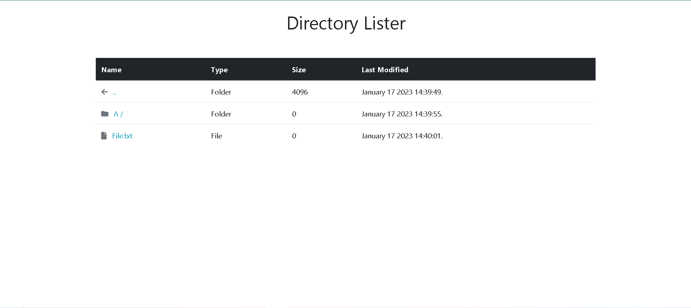

# Directory Lister

Directory Lister is a program that creates a more visually appealing and user-friendly page when accessing a directory listing or folder view. This program is built using PHP and utilizes Bootstrap to enhance its appearance.

## 📃 Installation

Step to make your directory listing more beauty

```
  1. Download index.php
  2. Upload index.php to spesific directory of your website
```

<p>If you want to ignoring spesific dir you can fill <b>ignoringFileDirs</b> variable in index.php</p>
<p>
  
</p>
<p>Example :</p> 

```
$ignoringFileDirs = ["directory1", "directory2", "etc.."];
```

<p>If you want to ignoring spesific file you can fill <b>ignoringExtensions</b> variable in index.php</p>
<p>
  
</p>
<p>Example : </p>

```
$ignoringExtensions = "png,pdf,php,txt";
```

## 📸 Preview
<p align="center">
<br>
  <strong>This look of the Directory Lister</strong>
</p>

## ✨ Feature
- Ignoring spesific folders
- Ignoring spesific files
- Detecting LFI exploitation to read any sensitive directory

## 💻 Code Used
[](https://img.shields.io/badge/HTML-E34F26?style=for-the-badge&logo=html5&logoColor=white) [](https://img.shields.io/badge/PHP-7A86B8?style=for-the-badge&logo=PHP&logoColor=white) [](https://img.shields.io/badge/Bootstrap-795da3?style=for-the-badge&logo=Bootstrap&logoColor=white)
